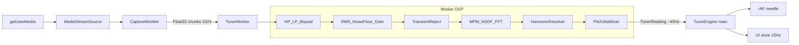
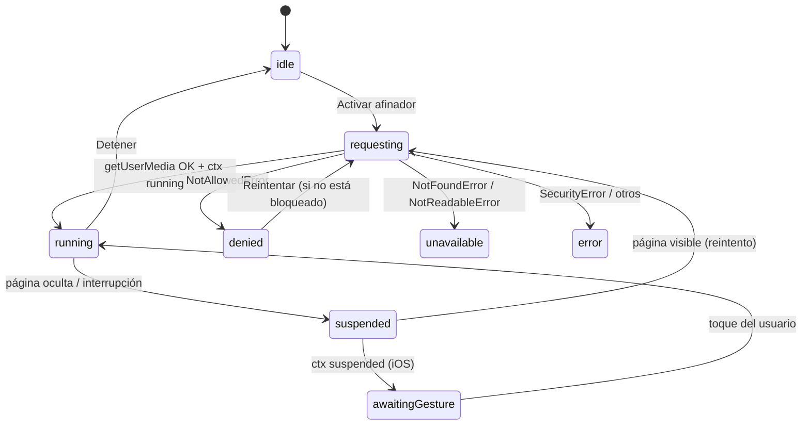

# Tuna UdeCLA — Afinador: Plan de Implementación

> Documento de arquitectura y plan de ejecución. Los detalles matemáticos y de DSP
> están en [TUNER_TECHNICAL_SPEC.md](TUNER_TECHNICAL_SPEC.md). Ambos documentos
> deben mantenerse consistentes: cualquier constante que cambie en uno debe
> cambiarse en el otro (ver §13, revisión cruzada).

---

## 1. Contexto y alcance

Aplicación web/PWA de afinación para integrantes de la Tuna de la Universidad de
Concepción, Campus Los Ángeles. Debe funcionar en navegadores móviles (Android y
iPhone) y de escritorio, desplegarse como sitio 100 % estático en GitHub Pages y
comportarse como app instalable (standalone, offline, icono propio).

**Principios rectores:**

1. **Precisión y estabilidad por encima de todo.** La aguja no debe bailar con
   ruido ambiente, voces ni armónicos.
2. **Privacidad total.** El audio se procesa localmente; nunca se graba, almacena
   ni transmite. Sin analytics ni trackers en v1.
3. **Mobile-first.** Diseñada para pantalla vertical de teléfono; el escritorio es
   una expansión elegante, no un móvil gigante.
4. **Sin backend.** Todo el procesamiento ocurre en el dispositivo.

**Fuera de alcance (v1):**

- Backend, cuentas de usuario, sincronización.
- Screen Wake Lock (evaluar en v1.1; en iOS requiere interacción y añade
  complejidad de ciclo de vida).
- Afinaciones personalizadas editables por el usuario (la del guitarrón se cambia
  en código, en un archivo aislado).
- Grabación, análisis de espectro visible, metrónomo, tono de referencia audible.
- Analytics, telemetría, publicidad.

---

## 2. Arquitectura y decisiones técnicas

### 2.1 Stack

| Pieza | Elección | Justificación |
|---|---|---|
| Framework | **React 19 + TypeScript** | Ecosistema, tipado estricto para el DSP |
| Build | **Vite 7** | Sitio estático, workers y worklets soportados |
| Estilos | **Tailwind CSS v4** (`@tailwindcss/vite`) | Tokens de marca en CSS, mobile-first |
| PWA | **vite-plugin-pwa** (`generateSW`, `registerType: 'prompt'`) | Service worker y precache del app shell sin escribir SW a mano |
| Iconos/splash | **@vite-pwa/assets-generator** | Genera iconos maskable, apple-touch-icon y splash screens de iOS desde un SVG fuente |
| Tests | **Vitest** | Mismo toolchain que Vite; el DSP es TS puro y testeable sin navegador |
| Fuentes | **@fontsource-variable/*** (autoalojadas) | Offline real; sin dependencia de Google Fonts |
| Router | **Ninguno** | Una sola página con vistas por estado (onboarding / afinador / ajustes). Evita los 404 de GitHub Pages y simplifica el precache |
| Estado | **Store propio con `useSyncExternalStore`** | Sin Redux/Zustand; el estado es pequeño y las lecturas de audio llegan a alta frecuencia por un canal aparte |

### 2.2 Base path (GitHub Pages)

El sitio se servirá desde `https://<usuario>.github.io/<repo>/`, por lo que:

- `vite.config.ts`: `base: process.env.VITE_BASE ?? '/'`.
- El workflow de GitHub Actions inyecta `VITE_BASE=/${{ github.event.repository.name }}/`.
- En desarrollo local el base es `/`.
- `manifest.start_url` y `manifest.scope` se declaran **relativos** (`'./'`) para
  que resuelvan correctamente bajo cualquier base.
- Todas las referencias a assets pasan por el pipeline de Vite (imports) o por
  `import.meta.env.BASE_URL`; nunca rutas absolutas hardcodeadas.

### 2.3 Hilos de ejecución (la decisión más importante de rendimiento)

El DSP nunca corre en el hilo principal ni dentro del `AudioWorklet` (el worklet
tiene presupuesto de ~3 ms por bloque y una FFT de 8192 no cabe con holgura en
dispositivos modestos). La cadena es:

```
getUserMedia → MediaStreamSource → AudioWorkletNode (captura, bloques de 1024)
   → MessageChannel → Web Worker (TODO el DSP + estabilizador)
   → TunerReading (~45 Hz) → hilo principal
```

- **AudioWorklet (`capture-worklet.ts`)**: solo copia el canal 0 de cada bloque de
  128 muestras a un búfer de 1024 y lo envía por `port.postMessage` (con
  transfer del ArrayBuffer). Sin lógica. Su salida se conecta a un `GainNode` con
  ganancia 0 → `destination`, porque Safari suspende worklets sin nodo conectado.
- **Fallback**: si `AudioWorkletNode` no existe, se usa `ScriptProcessorNode`
  (deprecated pero funcional) con el mismo contrato de mensajes.
- **Web Worker (`tuner.worker.ts`)**: recibe chunks `Float32`, mantiene el búfer
  de análisis, ejecuta el pipeline DSP completo y emite `TunerReading`.
  Se instancia con `new Worker(new URL('./tuner.worker.ts', import.meta.url),
  { type: 'module' })` y `worker.format: 'es'` en Vite.
- El worklet **no importa código de ejecución** (solo tipos): los módulos de
  worklet no pasan por el bundler de la misma forma y duplicarían código.



### 2.4 Rendimiento de la interfaz

- **La aguja no pasa por React.** Un loop de `requestAnimationFrame` lee el último
  `TunerReading` de una referencia mutable y escribe `transform` directamente en
  el SVG del arco. La aguja se mueve a la tasa de refresco de la pantalla con
  interpolación propia, desacoplada de la tasa de análisis.
- **Datos discretos** (nota, Hz, estado, pista de señal, cuerda detectada) se
  publican en el store de UI **como máximo ~15 veces/segundo y solo si cambian**
  (la cifra de cents tiene resolución de 0.5, ver spec §7).
- Resultado: React re-renderiza pocas veces por segundo incluso aunque el
  detector trabaje a ~45 fps internos.

### 2.5 Micrófono

- Restricciones: `{ audio: { echoCancellation: { ideal: false },
  noiseSuppression: { ideal: false }, autoGainControl: { ideal: false },
  channelCount: { ideal: 1 } } }`.
  - Se piden como `ideal` (preferencia, no requisito) para no fallar en
    dispositivos que no permitan desactivarlas.
  - **No se fuerza `sampleRate`**: iOS cambia entre 44.1/48 kHz según el
    dispositivo y la sesión; el DSP lee `audioContext.sampleRate` real.
- **Por qué desactivar el procesamiento del navegador:**
  - `noiseSuppression` está entrenada para voz: atenúa tonos sostenidos (una
    cuerda afinando es exactamente eso) y destruye armónicos.
  - `autoGainControl` bombea el nivel y rompe cualquier noise gate basado en
    umbrales.
  - `echoCancellation` introduce artefactos no lineales.
  - El ruido se gestiona con DSP propio (spec §4), que sí conoce el contexto
    musical.
- **Autoplay policy**: el `AudioContext` se crea y se llama `resume()` de forma
  **síncrona dentro del handler del botón** "Activar afinador", antes de
  `await getUserMedia`. Así el gesto del usuario sigue vigente.
- **Estados del permiso** (máquina de estados en §4):
  `idle → requesting → running`, con ramas `denied`, `unavailable`, `error`.
  Errores diferenciados: `NotAllowedError` (rechazado/bloqueado),
  `NotFoundError` (sin micrófono), `NotReadableError` (micrófono ocupado por
  otra app), `SecurityError` (contexto no seguro / HTTP).
- Se consulta `navigator.permissions.query({ name: 'microphone' })` cuando existe
  para detectar un permiso **bloqueado** antes de intentar, y mostrar
  instrucciones de desbloqueo específicas:
  - Chrome Android: candado en la barra → Permisos → Micrófono → Permitir.
  - Safari iOS: Ajustes → Safari → Micrófono, o el icono "aA" → Ajustes del sitio.
- **Ciclo de vida:**
  - `visibilitychange` a oculto → se detienen las pistas (`track.stop()`) y se
    marca estado `suspended`. Liberar el micrófono apaga el indicador del
    sistema y ahorra batería.
  - Al volver a visible → se reintenta `getUserMedia` automáticamente. Si el
    `AudioContext` quedó en `suspended`/`interrupted` (iOS), se muestra un
    overlay "Toca para reanudar" (reanudar exige gesto en iOS).
  - Se escuchan `track.onended`, `track.onmute` y `audioContext.onstatechange`.

### 2.6 Algoritmo de detección: MPM (McLeod Pitch Method)

**Decisión: MPM sobre NSDF calculada por FFT.** Comparación documentada:

| Criterio | MPM (NSDF) | YIN | Autocorrelación simple | Pico FFT |
|---|---|---|---|---|
| Métrica de confianza | Claridad del pico, 0–1, directa | Requiere umbral derivado | Sin métrica normalizada | Ninguna |
| Errores de subarmónico | Regla "primer key maximum ≥ k·max" los evita por diseño | Umbral absoluto, más frágil | Frecuentes | Constantes (armónicos) |
| Fundamental débil (graves) | Buena: trabaja con periodicidad temporal | Buena | Regular | Mala: si la fundamental es débil, elige el armónico |
| Costo | FFT de 2N por frame | O(N²) o FFT según implementación | O(N²) | Bajo, pero insuficiente |
| Afinación instrumental | Probado (Tartini, instrumentos reales) | Probado (Tuna.js usa variante) | — | No apto como método único |

Razones decisivas:

1. La **claridad NSDF es directamente la `confidence`** que pide el proyecto.
2. La regla de selección de máximos clave de MPM evita el error clásico de
   elegir la mitad del período (subarmónico) sin heurísticas adicionales.
3. Al ser un método de dominio temporal, detecta la periodicidad aunque la
   fundamental esté 10–20 dB por debajo del 2.º armónico — situación habitual en
   E2 de guitarra y A1 de guitarrón captados con micrófono de teléfono.
4. YIN queda como alternativa documentada si MPM mostrara problemas en la fase
   de calibración (F11); la interfaz `PitchDetector` permite intercambiarlos.

Parámetros (detalle y pseudocódigo en spec §5):

- Ventana `N = nextPow2(4 · sampleRate / fMin)`, acotada a `[2048, 8192]`.
  Con fMin = 40 Hz y 48 kHz → N = 4096. Ventana **rectangular** (sin Hann):
  una ventana clásica sesga el máximo de la NSDF en graves (ver spec §5.1).
- Salto de análisis (hop): 1024 muestras → ~46 lecturas/segundo a 48 kHz.
- NSDF por autocorrelación vía FFT con zero-padding a 2N; `m'(τ)` incremental.
- Interpolación parabólica sobre el máximo → resolución sub-muestra.

### 2.7 Armónicos y errores de octava

Los instrumentos de cuerda (y en especial bandurria y laúd, con cuerdas dobles y
brillo metálico) generan armónicos que pueden superar a la fundamental. Estrategia
en tres capas (pseudocódigo en spec §6):

1. **Modo cuerda seleccionada**: la búsqueda de máximos NSDF se restringe a
   τ ∈ [sr/(fObj·2^(600/1200)), sr/(fObj·2^(−600/1200))] — es decir, ±600 cents
   (media octava) alrededor de la frecuencia objetivo. Los errores de octava
   (±1200 cents) quedan **fuera del rango por construcción**. Es la mayor
   ganancia de estabilidad del producto.
2. **Validación cruzada**: si el máximo global de la NSDF (fuera del rango)
   tiene claridad muy superior y no guarda relación armónica entera con el
   candidato en rango, el frame se rechaza (`REJECT_HARMONIC_CONFLICT`).
3. **Modo automático**: se evalúan candidatos f·{1/3, 1/2, 1, 2, 3} con un score
   que combina claridad NSDF, cercanía a alguna cuerda del preset (en escala
   logarítmica) y continuidad temporal con la lectura anterior. Un **salto de
   octava solo se acepta si se sostiene 8 frames** (12 en modo Ambiente ruidoso).

**Riesgo conocido y documentado**: el guitarrón tiene A1 (55 Hz) y A2 (110 Hz)
en el mismo preset — una ambigüedad de octava *real*. En modo automático el
detector puede oscilar entre ambas. Mitigación: la UI recomienda seleccionar la
cuerda manualmente para guitarrón, y el pitch lock temporal favorece la última
cuerda estable.

### 2.8 Anti-ruido (resumen; detalle en spec §4)

- **Filtros biquad** en TS puro: paso alto a `0.6·fMin` (elimina rumble, viento,
  manejo) y paso bajo a `clamp(8·fMaxBúsqueda, 800, 5000)` Hz (elimina siseo y
  reduce aliasing de armónicos muy agudos).
- **Piso de ruido**: EMA asimétrica del RMS (sube rápido, baja lento), congelada
  mientras hay frames válidos.
- **Noise gate con histéresis** (umbrales en dBFS):

  | Parámetro | Normal | Ambiente ruidoso |
  |---|---|---|
  | Mínimo absoluto | −62 | −56 |
  | Apertura sobre piso | +9 dB | +13 dB |
  | Cierre sobre piso | +5 dB | +8 dB |

  La sensibilidad del usuario (Baja/Media/Alta) desplaza el umbral en ±6 dB.
- **Rechazo de transientes**: un salto de RMS > 6 dB respecto a la mediana de los
  3 hops anteriores bloquea la lectura durante 70 ms (100 ms en Ambiente ruidoso)
  y reinicia el búfer del estabilizador. Elimina golpes, palmadas y el "tac" de
  la púa.

### 2.9 Estabilizador (RAW PITCH ≠ DISPLAY PITCH)

El detector produce lecturas crudas a ~45 Hz; la UI nunca las muestra directas.
Pipeline del estabilizador (pseudocódigo completo en spec §7):

1. Búfer de las últimas **7** lecturas válidas (9 en Ambiente ruidoso).
2. Descarte de outliers: se eliminan las que distan más de **35 cents** (25 en
   Ambiente ruidoso) de la mediana.
3. Se exige un mínimo de **3** frames válidos (5 en Ambiente ruidoso) para
   publicar lectura.
4. Mediana → **EMA** con constante τ = 120 ms (220 ms en Ambiente ruidoso).
   Si la desviación respecto al valor suavizado supera 15 cents, τ baja a 35 ms
   (modo rápido, para seguir el giro de clavija).
5. **Pitch lock**: un frame que se desvía más de 60 cents (40 en Ambiente
   ruidoso) del valor bloqueado se rechaza, salvo que 4 frames consecutivos
   (6 en Ambiente ruidoso) concuerden entre sí; entonces se re-bloquea.
6. **Cambio de nota** con histéresis: la nota mostrada cambia solo al superar
   ±65 cents de la actual.
7. Resolución de display: la cifra de cents solo se actualiza si varía ≥ 0.5.
8. **Zona muerta de ±2 cents**, activa únicamente en estado "Afinado"
   (tolerancia ±5): la aguja permanece centrada ante micro-fluctuaciones, sin
   falsear nunca una desviación real.
9. **Estado "Afinado"**: exige |c| ≤ 5 sostenido durante 400 ms (550 ms en
   Ambiente ruidoso); se abandona con |c| > 7 durante 150 ms.
10. **Pérdida de señal**: la última lectura se retiene 700 ms; después, la UI
    vuelve a "Escuchando…".

### 2.10 Dirección del indicador (corrección al borrador)

El borrador del proyecto tenía las instrucciones laterales **invertidas**. Lo
correcto:

- **Izquierda del arco (cents negativos)** → la cuerda está **baja** →
  "Bajo · Tensa (sube)".
- **Derecha del arco (cents positivos)** → la cuerda está **alta** →
  "Alto · Afloja (baja)".

Etiquetas de estado con texto (no solo color): Muy bajo (< −15), Bajo
(−15…−5), Afinado (±5), Alto (+5…+15), Muy alto (> +15), con 2 cents de
histéresis entre etiquetas.

En **modo automático de instrumento**, la referencia de cents es la **cuerda más
cercana del preset** (frontera a mitad del intervalo en escala logarítmica), no
la nota cromática más cercana. En modo Cromático, la nota cromática más cercana.

### 2.11 Datos de instrumentos

- `src/config/tunings.ts`: listas de notas en texto (`'G#3'`), una constante por
  afinación. **`GUITARRON_TUNING` se exporta aislada y comentada** como punto de
  modificación si la Tuna usa otra variante.
- `src/config/instruments.ts`: `buildPreset()` deriva cada nota a partir de su
  nombre: número MIDI, nombre internacional, nombre latino (DO…SI con ♯), octava,
  `frequency(a4)`, número de cuerda/orden, cuerdas por orden y etiqueta opcional.
  Exporta `instrumentPresets: Record<InstrumentId, InstrumentPreset>`.
- Frecuencia: `f = a4 · 2^((midi − 69)/12)`, calculada sobre la A4 configurada.
  **No hay tablas de frecuencias hardcodeadas.**
- Rango de detección por preset: `[fGrave·2^(−0.5), fAguda·2^(+0.5)]` (media
  octava de margen). Cromático: 40–2000 Hz.
- Bandurria y laúd se modelan como 6 órdenes × 2 cuerdas al unísono
  (`stringsPerCourse: 2`); la UI muestra 6 botones y un consejo: "afina cada
  cuerda del orden por separado".

Afinaciones iniciales (grave → agudo):

| Instrumento | Notas | Órdenes |
|---|---|---|
| Guitarra | E2 A2 D3 G3 B3 E4 | 6 × 1 |
| Bandurria | G#3 C#4 F#4 B4 E5 A5 | 6 × 2 |
| Laúd | G#2 C#3 F#3 B3 E4 A4 | 6 × 2 |
| Guitarrón | A1 D2 G2 C3 E3 A2 | 6 × 1 |
| Cromático | — (12 notas) | — |

### 2.12 Ajustes y persistencia

`localStorage` con esquema versionado (`tuna-tuner:settings:v1`), validado al
cargar (valores fuera de rango → default). Contenido:

- `a4Reference`: 430–450 Hz (default 440).
- `noiseMode`: `'normal' | 'noisy'`.
- `notation`: `'latin' | 'international'`.
- `sensitivity`: `'low' | 'medium' | 'high'`.
- `vibrateOnTune`: boolean (solo se ofrece si `navigator.vibrate` existe).
- `lastInstrument`, `lastString`: última selección.
- `onboardingDone`: para no repetir el onboarding.
- Botón "Restablecer configuración".

Nunca se almacena audio ni datos de uso.

### 2.13 Identidad visual

- **Tema oscuro azul marino** como base (contraste alto en exteriores, aspecto
  premium). Tokens en `src/styles/theme.css` (Tailwind v4 `@theme`):
  - `brand-navy` (fondo), `brand-blue` (azul UdeC), `brand-gold` (dorado),
    `brand-white`, `brand-red` (reservado a "Muy bajo/Muy alto").
  - Los tonos exactos se ajustan cuando se disponga del manual de marca; los
    tokens centralizan el cambio.
- Motivos discretos: cinta diagonal azul/dorado en SVG (evoca becas/cintas de
  tuna) en header y onboarding; textura tenue de fondo; sin notas musicales
  flotando ni clichés.
- El escudo se usa **pequeño** (header, icono, splash). El protagonista es el
  afinador.
- Assets esperados (placeholders hasta que se entreguen):
  - `src/assets/brand/escudo-udec.svg` (o `.png`)
  - `src/assets/brand/tuna-cla.jpg` (foto de referencia, solo para inspiración de
    paleta; no necesariamente se muestra)
  - `src/assets/brand/icon-source.svg` (fuente para el generador de iconos PWA)

### 2.14 Herramienta de calibración

Parámetro de URL `?debug=1` que muestra un panel con: lectura cruda vs. lectura
mostrada, claridad NSDF, RMS, piso de ruido, estado del gate y código de rechazo.
Pensado para calibrar constantes en ensayos reales (F11). Todo se procesa y
muestra localmente.

---

## 3. Estructura de carpetas

```
├── .github/workflows/deploy.yml
├── index.html
├── package.json
├── vite.config.ts
├── tsconfig.json
├── README.md
├── IMPLEMENTATION_PLAN.md          (este documento)
├── TUNER_TECHNICAL_SPEC.md
├── public/
│   └── (iconos PWA generados, splash iOS, robots.txt)
├── scripts/
│   └── generate-pwa-assets.mjs
└── src/
    ├── main.tsx
    ├── App.tsx
    ├── vite-env.d.ts
    ├── types/
    │   └── index.ts                (InstrumentId, TunerReading, estados, mensajes)
    ├── config/
    │   ├── tunings.ts              (listas de notas; GUITARRON_TUNING aislada)
    │   ├── instruments.ts          (buildPreset, instrumentPresets, rangos)
    │   └── tuner.ts                (TODAS las constantes DSP por modo/sensibilidad)
    ├── dsp/                        (TS puro, sin DOM ni Web Audio: testeable en Vitest)
    │   ├── fft.ts                  (radix-2, reutilizable)
    │   ├── mpm.ts                  (NSDF, key maxima, interpolación)
    │   ├── filters.ts              (biquads HP/LP, fórmulas RBJ)
    │   ├── level.ts                (RMS, dBFS, piso de ruido, gate, transientes)
    │   ├── harmonics.ts            (resolución de armónicos/octava)
    │   ├── stabilizer.ts           (mediana, EMA, pitch lock, máquina "Afinado")
    │   ├── pipeline.ts             (orquesta las etapas por frame)
    │   └── music.ts                (MIDI↔Hz, cents, nombres latinos/internacionales)
    ├── audio/
    │   ├── capture-worklet.ts      (AudioWorkletProcessor mínimo)
    │   ├── tuner.worker.ts         (worker: búfer + pipeline + emisión)
    │   ├── AudioEngine.ts          (contexto, grafo, ciclo de vida, fallback)
    │   └── protocol.ts             (mensajes tipados worklet↔worker↔main)
    ├── state/
    │   ├── settings.ts             (store de ajustes + localStorage)
    │   └── tunerStore.ts           (estado discreto de UI vía useSyncExternalStore)
    ├── hooks/
    │   ├── useTuner.ts             (fachada: estado + acciones del motor)
    │   ├── useSettings.ts
    │   └── useNeedle.ts            (rAF → transform directo al SVG)
    ├── components/
    │   ├── layout/AppShell.tsx, Header.tsx
    │   ├── onboarding/Onboarding.tsx
    │   ├── permission/PermissionGate.tsx, PermissionHelp.tsx
    │   ├── tuner/TunerScreen.tsx, NoteDisplay.tsx, CentsGauge.tsx,
    │   │   StringSelector.tsx, SignalHint.tsx, InstrumentPicker.tsx
    │   ├── settings/SettingsSheet.tsx
    │   ├── pwa/UpdatePrompt.tsx
    │   └── ui/ (botones, segmented control, slider — primitivos propios)
    ├── screens/ (composición de vistas por estado; sin router)
    ├── styles/
    │   ├── index.css               (Tailwind + @theme tokens)
    │   └── theme.css
    ├── assets/brand/ (escudo, foto, icon-source)
    └── test/
        ├── signals.ts              (generador de señales sintéticas con semilla)
        └── *.test.ts               (spec §10)
```

**Regla de dependencias:** `dsp/` y `config/` no importan nada de React ni de Web
Audio. `audio/` depende de `dsp/`. `components/` solo ven `hooks/` y `state/`.
Esto permite probar todo el DSP en Node con Vitest.

---

## 4. Flujo del micrófono (máquina de estados)



Textos clave de la UI de permiso:

- Onboarding: "El audio se procesa exclusivamente en tu dispositivo. No se graba
  ni se envía a ningún servidor."
- Denegado (no bloqueado): "Necesitamos el micrófono para escuchar tu
  instrumento. Toca Reintentar y elige Permitir."
- Bloqueado: instrucciones específicas por navegador (Chrome Android / Safari iOS).
- Sin micrófono / ocupado: mensajes diferenciados.
- Contexto no seguro: "El afinador requiere HTTPS" (no debería ocurrir en Pages).

---

## 5. Resumen del pipeline DSP

Por cada hop de 1024 muestras (spec §3–§7):

1. Filtrado HP/LP (biquads).
2. RMS → dBFS; seguimiento de piso de ruido; gate con histéresis.
3. Detección de transiente (bloqueo temporal).
4. MPM sobre la ventana N: NSDF por FFT, key maxima, interpolación parabólica.
5. Resolución de armónicos (modo cuerda: rango ±600 cents + validación cruzada;
   modo automático: scoring de candidatos).
6. Validación del frame (claridad, nivel, rango) con códigos de rechazo.
7. Estabilizador: búfer → mediana → EMA → pitch lock → histéresis de nota →
   máquina de estado "Afinado".
8. Emisión de `TunerReading` al hilo principal.

---

## 6. UX/UI

### 6.1 Pantallas

1. **Onboarding** (primera vez): marca "TUNA UDEC — Afinador", tagline "Afina tu
   instrumento con precisión, dondequiera que estés.", botón primario grande
   "ACTIVAR AFINADOR", nota de privacidad. Cinta diagonal azul/dorado.
2. **Afinador** (principal):
   - Header compacto: escudo pequeño + "Tuna UdeC / Campus Los Ángeles" + botón
     de ajustes.
   - Selector de instrumento (segmented, scroll horizontal en móvil):
     Guitarra · Bandurria · Laúd · Guitarrón · Cromático.
   - Panel central: nombre latino grande (LA), internacional (A4), frecuencia
     (440.0 Hz), arco de cents −50…0…+50 con aguja, mensaje de estado.
   - Selector de cuerdas: 6 botones (etiqueta latina + internacional) +
     "Automático" primero. Oculto en Cromático.
   - Pista de señal discreta (SignalHint).
3. **Ajustes** (sheet/modal): A4 (slider 430–450 + display), Modo
   (Normal/Ambiente ruidoso), Notación (Latina/Internacional), Sensibilidad,
   Vibración (si disponible), Restablecer, texto de privacidad, versión.

### 6.2 Pistas de señal (SignalHint)

Prioridad de arriba hacia abajo; solo una visible:

| Condición | Texto |
|---|---|
| Gate cerrado | "Escuchando…" |
| RMS bajo pero > piso | "Señal débil — acerca el instrumento al micrófono" |
| Claridad baja con nivel OK | "Sonido inestable — toca solo una cuerda" |
| Lectura válida, fuera de afinación | etiqueta de estado (Bajo/Alto…) |
| Afinado sostenido | "Afinado" (+ verde, vibración opcional) |

**Regla de oro:** si la confianza es insuficiente, **no se muestra ninguna nota**;
se muestra "Escuchando…". Nunca una nota falsa.

### 6.3 Accesibilidad

- Texto además de color en todos los estados.
- Botones ≥ 48 × 48 px; el selector de cuerdas usable con una mano en ensayo.
- Contraste AA como mínimo (objetivo AAA en textos principales) sobre fondo navy.
- `aria-live="polite"` en el mensaje de estado; `role="meter"` con
  `aria-valuenow` (cents) en el arco.
- Respeta `prefers-reduced-motion`: desactiva la animación sutil de "Afinado".

### 6.4 Escritorio

Breakpoint `lg`: dos columnas — panel de medición (nota + arco) a la izquierda,
controles (instrumento, cuerdas, ajustes rápidos) a la derecha; ancho máximo
contenido (~1100 px). No es un móvil estirado.

---

## 7. PWA y GitHub Pages

- `vite-plugin-pwa`, `generateSW`, `registerType: 'prompt'`:
  - Precache del app shell completo (JS, CSS, fuentes, iconos) → offline total.
  - `navigateFallback` a `index.html` (aunque no hay router, cubre refrescos).
  - `UpdatePrompt.tsx`: aviso discreto "Nueva versión disponible — Actualizar"
    cuando el SW nuevo está en espera.
- Manifest: `display: 'standalone'`, `orientation: 'portrait'`,
  `theme_color` = navy, `background_color` = navy, `start_url`/`scope` relativos.
- Iconos: 192, 512 y **maskable** 512 generados desde `icon-source.svg` con
  `@vite-pwa/assets-generator`; `apple-touch-icon` 180; splash screens iOS
  generadas y enlazadas con `media` queries en `index.html`.
- Meta en `index.html`: `viewport-fit=cover`, `theme-color`,
  `apple-mobile-web-app-capable`, `apple-mobile-web-app-status-bar-style`
  (black-translucent), safe areas vía `env(safe-area-inset-*)` en CSS.
- Workflow `.github/workflows/deploy.yml`: Node 24, `npm ci`, `npm run test`,
  `npm run build`, `actions/upload-pages-artifact` + `actions/deploy-pages`.
  Inyecta `VITE_BASE`. Permisos `pages: write`, `id-token: write`.
- Script `dev:https` con `@vitejs/plugin-basic-ssl` para probar el micrófono en
  el teléfono dentro de la LAN (getUserMedia exige contexto seguro; localhost y
  HTTPS valen, la IP LAN sin TLS no).

---

## 8. Fases de desarrollo

Cada fase es pequeña, ejecutable y verificable de forma independiente.

### F0 — Scaffold y configuración base

- **OBJETIVO:** proyecto Vite + React + TS + Tailwind v4 compilando, con git
  inicializado.
- **ARCHIVOS:** `package.json`, `vite.config.ts`, `tsconfig.json`, `index.html`,
  `src/main.tsx`, `src/App.tsx`, `src/styles/index.css`, `.gitignore`.
- **IMPLEMENTACIÓN:** `npm create vite@latest` (react-ts), añadir
  `@tailwindcss/vite`, tokens de marca en `@theme`, `base` condicional por
  `VITE_BASE`, `worker.format: 'es'`. `git init`, primer commit.
- **VALIDACIÓN:** `npm run dev` muestra una página con los colores de marca;
  `npm run build` termina sin errores.
- **RESULTADO ESPERADO:** base lista para recibir módulos sin reconfigurar.

### F1 — Teoría musical y presets

- **OBJETIVO:** modelo de datos de instrumentos completo y testeado.
- **ARCHIVOS:** `src/dsp/music.ts`, `src/config/tunings.ts`,
  `src/config/instruments.ts`, `src/types/index.ts`, tests.
- **IMPLEMENTACIÓN:** MIDI↔Hz, cents, nombres latinos/internacionales;
  `buildPreset`; `instrumentPresets` con rangos; `GUITARRON_TUNING` aislada.
- **VALIDACIÓN:** tests: A4=440 → 440.0 Hz; E2 ≈ 82.41 Hz; con A4=432 todas las
  frecuencias escalan; nombres latinos correctos (G#3 → SOL♯3).
- **RESULTADO ESPERADO:** ningún componente futuro contendrá frecuencias
  hardcodeadas.

### F2 — FFT, MPM y señales sintéticas

- **OBJETIVO:** detector de pitch funcionando en Node contra señales generadas.
- **ARCHIVOS:** `src/dsp/fft.ts`, `src/dsp/mpm.ts`, `src/test/signals.ts`, tests.
- **IMPLEMENTACIÓN:** FFT radix-2; NSDF por FFT con zero-padding; key maxima con
  umbral k; interpolación parabólica; generador con semilla (senos, parciales,
  ruido, decaimiento, Karplus-Strong).
- **VALIDACIÓN:** tolerancias de la spec §10 (seno puro ≤ 1 cent entre 80–1000
  Hz, ≤ 2 cents bajo 80 Hz; mezcla 220+440 → 220 Hz).
- **RESULTADO ESPERADO:** `detectPitch(buffer, sampleRate, rango)` fiable antes
  de tocar Web Audio.

### F3 — Filtros, nivel, gate, transientes, armónicos y pipeline

- **OBJETIVO:** pipeline de frame completo con validación y códigos de rechazo.
- **ARCHIVOS:** `src/dsp/filters.ts`, `src/dsp/level.ts`,
  `src/dsp/harmonics.ts`, `src/dsp/pipeline.ts`, `src/config/tuner.ts`, tests.
- **IMPLEMENTACIÓN:** biquads RBJ; RMS/dBFS; piso de ruido; gate con histéresis;
  bloqueo de transientes; resolución armónica (modo cuerda ±600 cents +
  validación cruzada; modo automático con scoring); `processFrame()`.
- **VALIDACIÓN:** silencio y ruido blanco → ≥ 99 % frames sin nota; señal con
  fundamental débil → octava correcta ≥ 98 %; transientes no producen lectura.
- **RESULTADO ESPERADO:** el pipeline rechaza ruido y armónicos sin intervención
  del estabilizador.

### F4 — Estabilizador

- **OBJETIVO:** DISPLAY PITCH suave y preciso a partir de lecturas crudas.
- **ARCHIVOS:** `src/dsp/stabilizer.ts`, tests.
- **IMPLEMENTACIÓN:** búfer + mediana + EMA adaptativa + pitch lock + histéresis
  de nota + zona muerta + máquina "Afinado" + retención de 700 ms.
- **VALIDACIÓN:** con fluctuación de entrada ±3 cents, la desviación estándar
  mostrada < 1 cent; tiempo hasta "Afinado" ≈ 400 ms; cambio de nota sin
  parpadeo en la frontera.
- **RESULTADO ESPERADO:** aguja estable que sigue siendo honesta.

### F5 — Motor de audio

- **OBJETIVO:** captura real en navegador, en los hilos correctos, con ciclo de
  vida completo.
- **ARCHIVOS:** `src/audio/capture-worklet.ts`, `src/audio/tuner.worker.ts`,
  `src/audio/AudioEngine.ts`, `src/audio/protocol.ts`, `src/hooks/useTuner.ts`.
- **IMPLEMENTACIÓN:** worklet de captura + GainNode(0); fallback
  ScriptProcessor; worker con el pipeline de F3/F4; máquina de estados del
  micrófono; manejo de `visibilitychange`, `onstatechange`, `onended`.
- **VALIDACIÓN:** en Chrome desktop y Android y Safari iOS: permiso, lectura de
  un tono de 440 Hz generado externamente, suspensión y reanudación al cambiar
  de app.
- **RESULTADO ESPERADO:** `useTuner()` entrega `TunerReading` estables con audio
  real.

### F6 — Ajustes y persistencia

- **OBJETIVO:** store de ajustes versionado y aplicado en caliente.
- **ARCHIVOS:** `src/state/settings.ts`, `src/hooks/useSettings.ts`, tests.
- **IMPLEMENTACIÓN:** carga/validación/guardado en localStorage; cambios de A4,
  modo y sensibilidad se propagan al worker sin reiniciar el micrófono.
- **VALIDACIÓN:** recargar la página conserva ajustes; valores corruptos en
  localStorage caen a defaults; A4=432 cambia las frecuencias objetivo en vivo.
- **RESULTADO ESPERADO:** preferencias persistentes y robustas.

### F7 — Sistema visual

- **OBJETIVO:** tokens, primitivos de UI y componentes del afinador con datos
  simulados.
- **ARCHIVOS:** `src/styles/theme.css`, `src/components/ui/*`,
  `src/components/tuner/*`, `src/components/layout/*`.
- **IMPLEMENTACIÓN:** arco SVG con aguja por rAF (`useNeedle`), NoteDisplay,
  StringSelector, InstrumentPicker, SignalHint; cinta diagonal; responsive
  móvil/escritorio; `prefers-reduced-motion`.
- **VALIDACIÓN:** con un "motor falso" que emite lecturas guionizadas, la UI
  reproduce todos los estados; contraste verificado; aguja fluida a 60 fps sin
  re-renders de React.
- **RESULTADO ESPERADO:** interfaz completa testeable sin micrófono.

### F8 — Pantallas y flujo de permisos

- **OBJETIVO:** onboarding, PermissionGate, SettingsSheet y composición final.
- **ARCHIVOS:** `src/components/onboarding/*`, `src/components/permission/*`,
  `src/components/settings/*`, `src/screens/*`, `src/App.tsx`.
- **IMPLEMENTACIÓN:** máquina de estados del §4 con sus textos; instrucciones de
  desbloqueo por navegador; sheet de ajustes conectado a F6; vibración al afinar
  (opcional).
- **VALIDACIÓN:** recorrido completo: primera visita → onboarding → permiso →
  afinador; denegar permiso muestra ayuda correcta; ajustes se aplican.
- **RESULTADO ESPERADO:** la app es usable de punta a punta en desarrollo.

### F9 — PWA

- **OBJETIVO:** instalable y offline.
- **ARCHIVOS:** `vite.config.ts` (plugin PWA), `scripts/generate-pwa-assets.mjs`,
  `public/*` generados, `index.html` (meta iOS, splash), `UpdatePrompt.tsx`.
- **IMPLEMENTACIÓN:** manifest completo, iconos normales + maskable +
  apple-touch-icon + splash iOS, precache del shell, aviso de actualización.
- **VALIDACIÓN:** Lighthouse PWA sin errores bloqueantes; `npm run build` +
  preview → instalar en Android; modo avión → la app abre y afina.
- **RESULTADO ESPERADO:** app instalable con soporte offline real.

### F10 — Workflow y README

- **OBJETIVO:** despliegue automático a GitHub Pages y documentación de uso.
- **ARCHIVOS:** `.github/workflows/deploy.yml`, `README.md`.
- **IMPLEMENTACIÓN:** workflow con `VITE_BASE`; README con instrucciones de
  instalación: Android (Chrome → Agregar a pantalla de inicio / Instalar
  aplicación) e iPhone (Safari → Compartir → Agregar a pantalla de inicio), más
  nota de privacidad.
- **VALIDACIÓN:** push a `main` → deploy verde → la app carga desde
  `https://<usuario>.github.io/<repo>/` sin errores de assets ni de SW.
- **RESULTADO ESPERADO:** cada push publica la app.

### F11 — Calibración en dispositivos reales

- **OBJETIVO:** ajustar constantes con instrumentos reales de la Tuna.
- **ARCHIVOS:** `src/config/tuner.ts` (ajustes de valores), panel `?debug=1`.
- **IMPLEMENTACIÓN:** sesiones de prueba con guitarra, bandurria, laúd y
  guitarrón en sala silenciosa y en ensayo real; ajuste de umbrales de gate,
  claridad mínima y tiempos del estabilizador; matriz de pruebas (criterio 6 y 7
  de aceptación).
- **VALIDACIÓN:** los 15 criterios de aceptación (§10) verificados en al menos
  un Android y un iPhone reales.
- **RESULTADO ESPERADO:** constantes finales documentadas y app validada en
  terreno.

---

## 9. Archivos a crear (lista completa)

**Raíz:** `package.json`, `vite.config.ts`, `tsconfig.json`,
`tsconfig.node.json`, `index.html`, `.gitignore`, `README.md`,
`IMPLEMENTATION_PLAN.md`, `TUNER_TECHNICAL_SPEC.md`,
`.github/workflows/deploy.yml`, `scripts/generate-pwa-assets.mjs`.

**`src/`:** `main.tsx`, `App.tsx`, `vite-env.d.ts`.

**`src/types/`:** `index.ts`.

**`src/config/`:** `tunings.ts`, `instruments.ts`, `tuner.ts`.

**`src/dsp/`:** `fft.ts`, `mpm.ts`, `filters.ts`, `level.ts`, `harmonics.ts`,
`stabilizer.ts`, `pipeline.ts`, `music.ts`.

**`src/audio/`:** `capture-worklet.ts`, `tuner.worker.ts`, `AudioEngine.ts`,
`protocol.ts`.

**`src/state/`:** `settings.ts`, `tunerStore.ts`.

**`src/hooks/`:** `useTuner.ts`, `useSettings.ts`, `useNeedle.ts`.

**`src/components/`:** `layout/AppShell.tsx`, `layout/Header.tsx`,
`onboarding/Onboarding.tsx`, `permission/PermissionGate.tsx`,
`permission/PermissionHelp.tsx`, `tuner/TunerScreen.tsx`,
`tuner/NoteDisplay.tsx`, `tuner/CentsGauge.tsx`, `tuner/StringSelector.tsx`,
`tuner/SignalHint.tsx`, `tuner/InstrumentPicker.tsx`,
`settings/SettingsSheet.tsx`, `pwa/UpdatePrompt.tsx`, `ui/Button.tsx`,
`ui/SegmentedControl.tsx`, `ui/Slider.tsx`, `ui/Sheet.tsx`.

**`src/screens/`:** `RootScreen.tsx` (composición por estado).

**`src/styles/`:** `index.css`, `theme.css`.

**`src/assets/brand/`:** `escudo-udec.svg|png`, `tuna-cla.jpg`,
`icon-source.svg` (pendientes de entrega; placeholders mientras).

**`src/test/`:** `signals.ts`, `music.test.ts`, `mpm.test.ts`,
`pipeline.test.ts`, `stabilizer.test.ts`, `settings.test.ts`.

**`public/`:** iconos PWA generados, splash iOS, `robots.txt`.

Ningún archivo existente se modifica (el repositorio parte vacío).

---

## 10. Riesgos técnicos

| Riesgo | Impacto | Mitigación |
|---|---|---|
| Micrófonos de teléfono con poca respuesta < 80 Hz (A1/E2) | Detección débil del guitarrón | MPM temporal (no depende de la energía de la fundamental); modo cuerda con rango estrecho; documentar en README tocar cerca del micrófono |
| iOS cambia `sampleRate` entre sesiones/dispositivos | Cálculos erróneos si se asume 48 kHz | Leer siempre `audioContext.sampleRate`; el worker se configura con el valor real |
| Permiso de micrófono en iOS standalone (pantalla de inicio) | Flujo de permiso distinto a Safari | Probar en F5/F11 el flujo instalado; mensajes de ayuda específicos |
| A1 vs A2 del guitarrón: ambigüedad de octava real | Oscilación en modo automático | Recomendar selección manual de cuerda; pitch lock favorece continuidad |
| Batimiento entre las 2 cuerdas de un orden (bandurria/laúd) | Claridad NSDF baja, lectura inestable | Consejo en UI: afinar cada cuerda del orden por separado; modo cuerda estrecho |
| Inharmonicidad de cuerdas graves (parciales desviados) | Ligero sesgo en cents | Interpolación parabólica + mediana; aceptable para afinación práctica |
| Uso del escudo UdeC en icono de app | Restricciones de marca institucional | Confirmar permiso de uso; alternativa: monograma "T" con cinta azul/dorado |
| `ScriptProcessorNode` en navegadores muy antiguos | Latencia mayor en el fallback | Solo fallback; el objetivo son navegadores modernos |
| GitHub Pages sin HTTPS en dominio personalizado mal configurado | getUserMedia bloqueado | Pages sirve HTTPS por defecto; mensaje de error claro si no es contexto seguro |

---

## 11. Criterios de aceptación y verificación

| # | Criterio | Método de verificación |
|---|---|---|
| 1 | Micrófono funciona en Android y iOS modernos | F5/F11: Chrome Android y Safari iOS reales, permiso + lectura de tono 440 Hz |
| 2 | La interfaz reconoce correctamente los presets | F1 tests + F8: al cambiar de instrumento cambian cuerdas y rango |
| 3 | Cromático identifica nota y octava | F2/F3 tests con barrido de senos; F11 con instrumento real |
| 4 | Lectura muestra Hz y cents | F7 con motor simulado; F11 con tono conocido |
| 5 | No reacciona al silencio | F3 test: silencio → 0 notas; F11: 30 s en silencio sin lectura |
| 6 | Ruido ambiental moderado no provoca cambios constantes | F3 test ruido blanco ≥ 99 % sin nota; F11 en sala con conversación de fondo |
| 7 | Cuerda seleccionada mejora considerablemente la estabilidad | F11: comparar desviación estándar de cents automático vs. cuerda fija con el panel debug |
| 8 | Armónicos no provocan saltos frecuentes de octava | F3 tests (fundamental débil, parciales fuertes) ≥ 98 % octava correcta; F11 con bandurria |
| 9 | La aguja es suave pero precisa | F4 tests (σ < 1 cent con jitter ±3); F11 percepción en uso real |
| 10 | La PWA se instala | F9: instalar en Android y "Agregar a pantalla de inicio" en iPhone |
| 11 | Funciona desde GitHub Pages | F10: deploy verde, assets y SW correctos bajo el base path |
| 12 | El audio nunca abandona el dispositivo | Revisión de código: sin fetch/WebSocket con audio; pestaña Network vacía durante el uso |
| 13 | Las preferencias persisten | F6: recargar y verificar A4, modo, notación, último instrumento |
| 14 | La app se adapta correctamente a móvil | F7/F11: pantallas 360–430 px, safe areas de iPhone, botones ≥ 48 px |
| 15 | `npm run build` termina sin errores | F0 en adelante: build limpio en CI en cada push |

---

## 12. Privacidad

Texto que aparece en onboarding y ajustes:

> "El audio se analiza en tiempo real en este dispositivo. No se graba ni se
> envía a ningún servidor."

Sin analytics, sin trackers, sin cookies de terceros. El único almacenamiento es
`localStorage` con las preferencias del §2.12.

---

## 13. Revisión cruzada de consistencia

Las siguientes constantes aparecen en ambos documentos y deben coincidir
(fuente de verdad: `src/config/tuner.ts` una vez implementado):

| Constante | Normal | Ambiente ruidoso |
|---|---|---|
| Gate: mínimo absoluto | −62 dBFS | −56 dBFS |
| Gate: apertura / cierre sobre piso | +9 / +5 dB | +13 / +8 dB |
| Bloqueo por transiente | 70 ms | 100 ms |
| Búfer del estabilizador | 7 | 9 |
| Outlier vs. mediana | 35 cents | 25 cents |
| Frames válidos mínimos | 3 | 5 |
| EMA τ (normal / rápida) | 120 / 35 ms | 220 / 35 ms |
| Pitch lock: desviación / frames para re-bloquear | 60 cents / 4 | 40 cents / 6 |
| Salto de octava sostenido | 8 frames | 12 frames |
| "Afinado": umbral / tiempo / salida | ±5 cents / 400 ms / >7 cents por 150 ms | ±5 cents / 550 ms / >7 cents por 150 ms |
| Histéresis de cambio de nota | ±65 cents | ±65 cents |
| Zona muerta (solo en "Afinado") | ±2 cents | ±2 cents |
| Retención tras pérdida de señal | 700 ms | 700 ms |
| Rango modo cuerda | ±600 cents del objetivo | ±600 cents del objetivo |
| Sensibilidad (Baja/Alta) | ∓6 / ±6 dB sobre umbral | ∓6 / ±6 dB sobre umbral |
